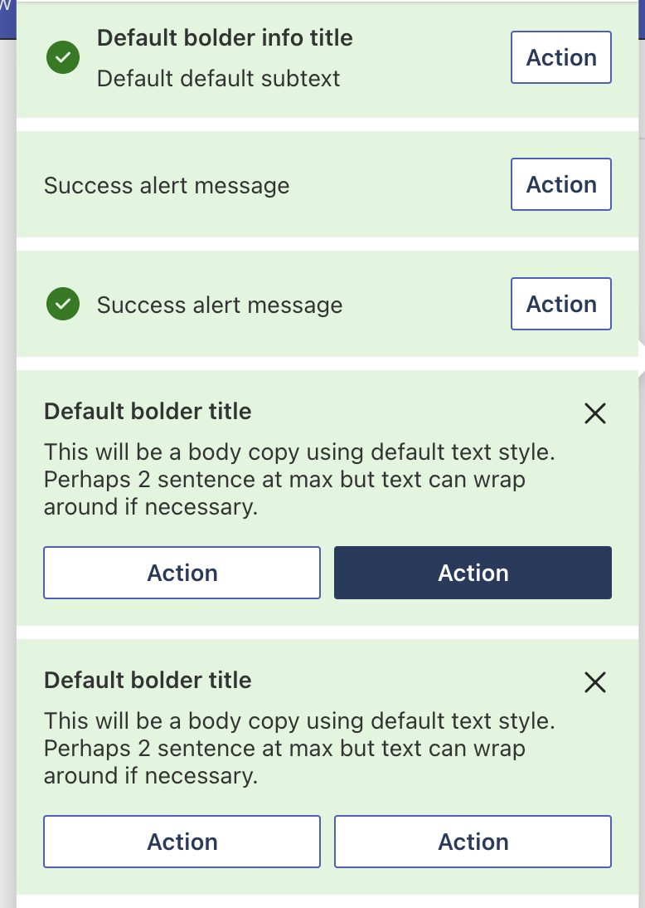
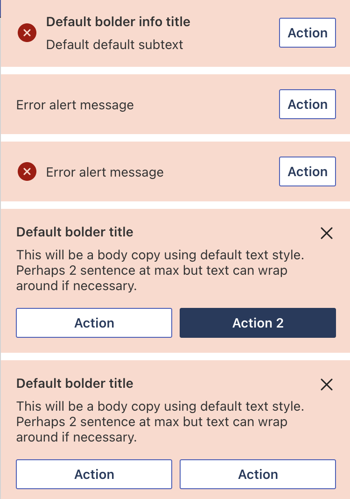
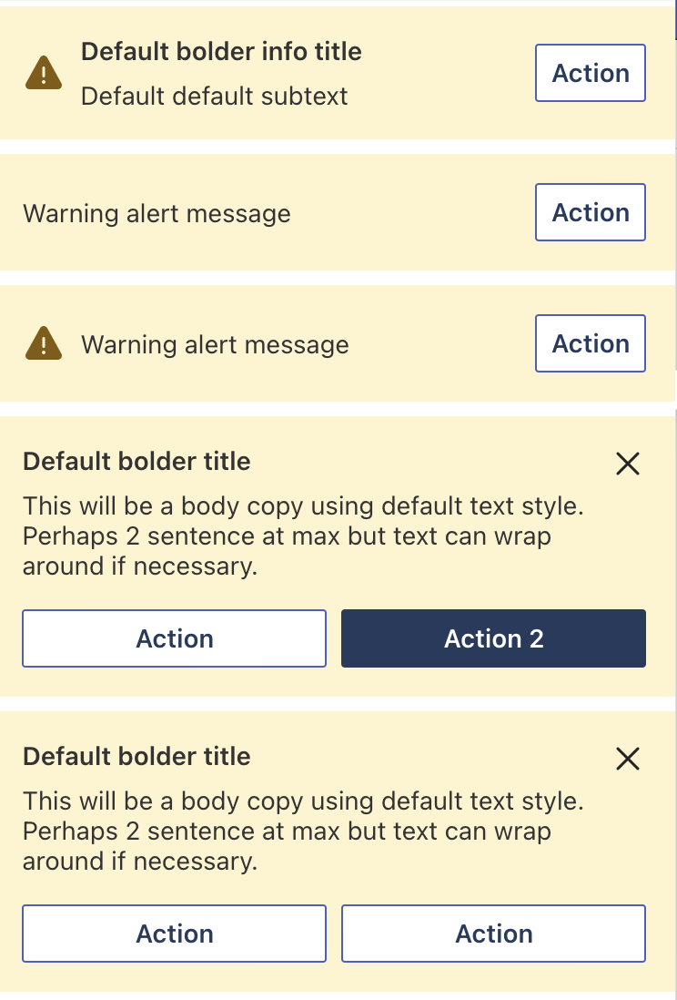
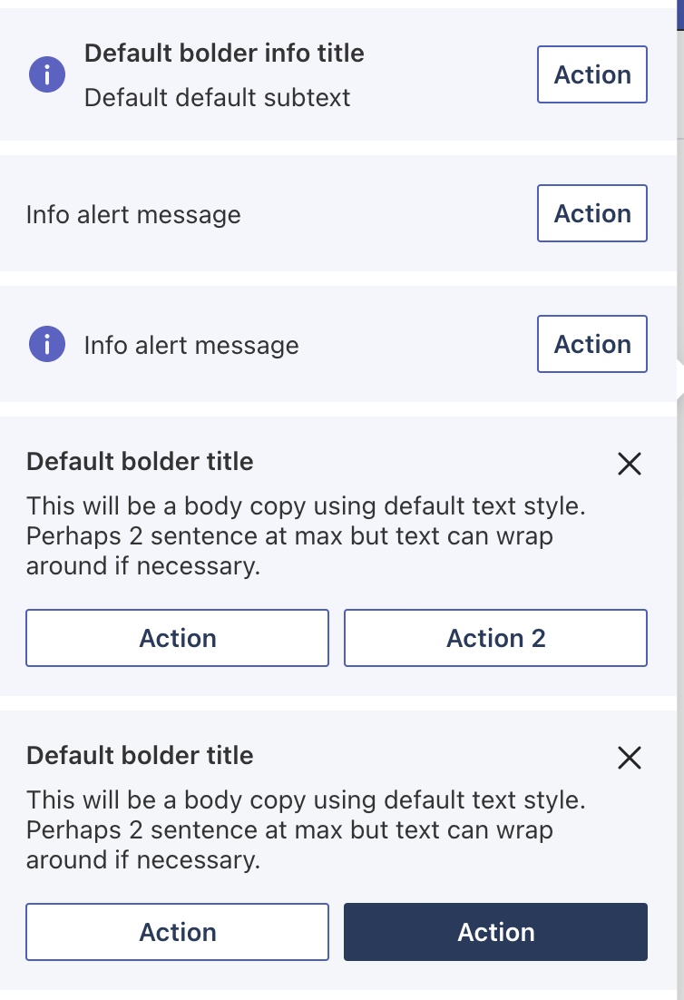
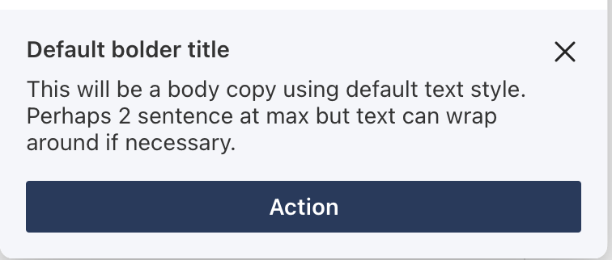

# ACE UX Components

## Table of content

1. [About createTemplate](#about-createtemplate)
2. [Elements](#elements)
3. [Figma file](#figma-file)
4. [Components](#components)

## About createTemplate

The `createTemplate` function is defined here and exposed as part of this library. This function returns an `ISPFxAdaptiveCard` object, so this is should be the starting point of every quickview's `template` getter. It takes a `body` and `actions` as params (`actions` is optional). The `body` is a list of AdaptiveCard elements (more in the [Elements](#elements) section) that will basically consists of the quickview's UI. The `actions` are the main set of actions the quickview possess (displayed at the bottom of the quickview).

The function already defines the schema, the type and the version properties of `ISPFxAdaptiveCard`, so no need to specify them.

## Elements

The elements directory contains every basic AdaptiveCards UI elements that are available at the version we're currently using. There's `TextBlock`, `Container`, `ActionSubmit`, just to name a few. For more details on those elements, please refer to the [AdaptiveCards documentation](https://adaptivecards.io/explorer/AdaptiveCard.html) for the full list of elements available.

If a property of an element or an entire element is missing in this library, please double check the version where that property and/or element has been introduced in AdaptiveCards. If it's available in the version we're currently using, feel free to contribute to this component library or reach out to the [ACE UX Components crew](mailto:aceuxcomponentscrew@microsoft.com)

## Components

The different components are more complex and are built using the elements mentioned earlier. Here's the list.

| Component                               | Description                                                                                                          |
| --------------------------------------- | -------------------------------------------------------------------------------------------------------------------- |
| [Alert box](#alert-box)                 | Alert box to display message(s) with option to add confirmation buttons.                                             |
| [Empty view](#empty-view)               | A container displaying an image with some text. Can optionally include a description and button.                     |
| [Error view](#error-view)               | A container displaying an image with some text. Can optionally include a description and button.                     |
| [Header](#header)                       | A header component to standardize view headers.                                                                      |
| [File attachment](#file-attachment)     | An action to select files along with the list of selected files. Clicking one of the selected files opens a preview. |
| [Items list](#items-list)               | A list of items. There are 3 different styles that can be used.                                                      |
| [List](#list)                           | A list component. There are 2 differents variants: Basic and Multiline lists.                                        |
| [Loading indicator](#loading-indicator) | A loading spinner along with a label used to display something is loading.                                           |
| [Persona](#persona)                     | A component used to display people's information (profile picture, name, job title, etc.).                           |
| [Picker](#picker)                       | A selectable element that displays the currently selected item. Selecting it opens the list of items.                |
| [Search bar](#search-bar)               | A text input along with a confirmation and cancellation button. Should be used to either search or filter.           |
| [Search component](#search-component)   | An all-in-one component displaying the search bar and search results. The data must be passed to the component.      |
| [Section list](#section-list)           | A component used to display multiple lists separated by sections.                                                    |
| [Success view](#success-view)           | A container displaying an image with some text. Can optionally include a description and butt                        |
| [Toggle row](#toggle-row)               | A container with Title, description and Input toggle with default value false.                                       |

---

### Alert box

Alert box to display message(s) with option to add confirmation buttons.

| Props             | Type                                         | Required | Description                                                                                            |
| ----------------- | -------------------------------------------- | -------- | ------------------------------------------------------------------------------------------------------ |
| alertType         | Enum `AlertType` [Success, Failure, Warning] | Yes      | AlertType will used as heading on the alert. It will also be used to set background color of the same. |
| alertMessage      | string                                       | Yes      | Detailed message for the alert                                                                         |
| alertAction       | `AlertAction`                                | No       | Action button for the alert. Eg - `Ok`, `Dismiss`                                                      |
| alertConfirmation | `AlertConfirmation`                          | No       | Confirmation buttons for alert. Eg - `Cancel - Dismiss`, `No - Yes`, `Back - Continue`                 |

Usage:

```TypeScript
class TestView extends BaseAdaptiveCardView<{}, State, Data> {
  public get template(): ISPFxAdaptiveCard {
    return createTemplate([
      new AlertBox(AlertType.Success, "Your action has been completed.", {
        actionText: "Dismiss",
        actionId: "dismissId",
      }),
    ]);
  }
}
```

Example:


---

### Success Alert box view

Success Alert box view to display message(s) with option to add confirmation buttons.

| Props              | Type                | Required | Description                                      |
| ------------------ | ------------------- | -------- | ------------------------------------------------ |
| message            | string              | Yes      | Detailed message for the alert                   |
| icon               | `AlertIcon`         | No       | Icon to render instead of default icon           |
| showDefaultIcon    | boolean             | No       | Decide to render default success icon or not     |
| alertAction        | `AlertViewAction[]` | No       | Action buttons for alert                         |
| title              | string              | No       | Title of the alert                               |
| showActionAtFooter | boolean             | No       | Decide to render action buttons at footer or not |

Usage:

```TypeScript
class TestView extends BaseAdaptiveCardView<{}, State, Data> {
  public get template(): ISPFxAdaptiveCard {
    return createTemplate([
      new SuccessAlertBoxView("Your action has been completed."),
    ]);
  }
}
```

Example:





---

### Error Alert box view

Error Alert box view to display message(s) with option to add confirmation buttons.

| Props              | Type                | Required | Description                                      |
| ------------------ | ------------------- | -------- | ------------------------------------------------ |
| message            | string              | Yes      | Detailed message for the alert                   |
| icon               | `AlertIcon`         | No       | Icon to render instead of default icon           |
| showDefaultIcon    | boolean             | No       | Decide to render default success icon or not     |
| alertAction        | `AlertViewAction[]` | No       | Action buttons for alert                         |
| title              | string              | No       | Title of the alert                               |
| showActionAtFooter | boolean             | No       | Decide to render action buttons at footer or not |

Usage:

```TypeScript
class TestView extends BaseAdaptiveCardView<{}, State, Data> {
  public get template(): ISPFxAdaptiveCard {
    return createTemplate([
      new ErrorAlertBoxView("Your action has been completed."),
    ]);
  }
}
```

Example:





---

### Warning Alert box view

Warning Alert box view to display message(s) with option to add confirmation buttons.

| Props              | Type                | Required | Description                                      |
| ------------------ | ------------------- | -------- | ------------------------------------------------ |
| message            | string              | Yes      | Detailed message for the alert                   |
| icon               | `AlertIcon`         | No       | Icon to render instead of default icon           |
| showDefaultIcon    | boolean             | No       | Decide to render default success icon or not     |
| alertAction        | `AlertViewAction[]` | No       | Action buttons for alert                         |
| title              | string              | No       | Title of the alert                               |
| showActionAtFooter | boolean             | No       | Decide to render action buttons at footer or not |

Usage:

```TypeScript
class TestView extends BaseAdaptiveCardView<{}, State, Data> {
  public get template(): ISPFxAdaptiveCard {
    return createTemplate([
      new WarningAlertBoxView("Your action has been completed."),
    ]);
  }
}
```

Example:





---

### Info Alert box view

Info Alert box view to display message(s) with option to add confirmation buttons.

| Props              | Type                | Required | Description                                      |
| ------------------ | ------------------- | -------- | ------------------------------------------------ |
| message            | string              | Yes      | Detailed message for the alert                   |
| icon               | `AlertIcon`         | No       | Icon to render instead of default icon           |
| showDefaultIcon    | boolean             | No       | Decide to render default success icon or not     |
| alertAction        | `AlertViewAction[]` | No       | Action buttons for alert                         |
| title              | string              | No       | Title of the alert                               |
| showActionAtFooter | boolean             | No       | Decide to render action buttons at footer or not |

Usage:

```TypeScript
class TestView extends BaseAdaptiveCardView<{}, State, Data> {
  public get template(): ISPFxAdaptiveCard {
    return createTemplate([
      new InfoAlertBoxView("Your action has been completed."),
    ]);
  }
}
```

Example:






---

### Empty view

A container displaying an image with some text. Can optionally include a description and button.

| Props         | Type            | Required | Description                                                                                                 |
| ------------- | --------------- | -------- | ----------------------------------------------------------------------------------------------------------- |
| stateViewType | `StateViewType` | Yes      | Dictates what kind of display you want to have, either full screen ("Full"), or just a section. ("Section") |
| header        | `string`        | Yes      | Contains the header to be displayed.                                                                        |

Usage:

```TypeScript
class TestView extends BaseAdaptiveCardView<{}, State, Data> {
  public get template(): ISPFxAdaptiveCard {
    return createTemplate([
      new EmptyView("Full", "Empty header comes here")
        .withDescription("Here is an optional description as well")
        .withButton({ title: "Optional Button", actionID: "1", altText: "Optional Button Alt Text" }),
    ]);
  }
}
```

```TypeScript
class TestView extends BaseAdaptiveCardView<{}, State, Data> {
  public get template(): ISPFxAdaptiveCard {
    return createTemplate([
      new EmptyView("Section", "Empty header comes here"),
    ]);
  }
}
```

Examples:

Empty View set to "Full" With Optional Button


Empty View set to "Section" With Optional Button


---

### Error view

A container displaying an image with some text. Can optionally include a description and button.

| Props         | Type            | Required | Description                                                                                                 |
| ------------- | --------------- | -------- | ----------------------------------------------------------------------------------------------------------- |
| stateViewType | `StateViewType` | Yes      | Dictates what kind of display you want to have, either full screen ("Full"), or just a section. ("Section") |
| header        | `string`        | Yes      | Contains the header to be displayed.                                                                        |

Usage:

```TypeScript
class TestView extends BaseAdaptiveCardView<{}, State, Data> {
  public get template(): ISPFxAdaptiveCard {
    return createTemplate([
      new ErrorView("Full", "Error header comes here")
        .withDescription("Here is an optional description as well")
        .withButton({ title: "Optional Button", actionID: "1", altText: "Optional Button Alt Text" }),
    ]);
  }
}
```

```TypeScript
class TestView extends BaseAdaptiveCardView<{}, State, Data> {
  public get template(): ISPFxAdaptiveCard {
    return createTemplate([
      new ErrorView("Section", "Error header comes here"),
    ]);
  }
}
```

Examples:

Error View set to "Full" With Optional Button


Error View set to "Section" With Optional Button


---

### Header

A header component to standardize view headers.

| Props | Type                     | Required | Description                                                                      |
| ----- | ------------------------ | -------- | -------------------------------------------------------------------------------- |
| type  | `HeaderType`             | yes      | Type of header to be displayed.                                                  |
| title | `string`                 | no\*     | Header title. Only needed for the `HeaderType.Basic` header.                     |
| type  | `Picker<TProps, TState>` | no\*     | Picker to be used as the header. Only needed for the `HeaderType.Picker` header. |

Usage:

```TypeScript
// Basic header.
class TestView extends BaseAdaptiveCardView<{}, State, Data> {
  public get template(): ISPFxAdaptiveCard {
    return createTemplate([
      new Header(HeaderType.Basic, "Header title"),
    ]);
  }
}
```

```TypeScript
// Basic header with description and call to action.
class TestView extends BaseAdaptiveCardView<{}, State, Data> {
  public get template(): ISPFxAdaptiveCard {
    return createTemplate([
      new Header(HeaderType.Basic, "Header title").withDescription("Header description").withCallToAction("actionId", "Button text"),
    ]);
  }
}
```

```TypeScript
// Empty header.
class TestView extends BaseAdaptiveCardView<{}, State, Data> {
  public get template(): ISPFxAdaptiveCard {
    return createTemplate([
      new Header(HeaderType.Empty),
    ]);
  }
}
```

```TypeScript
// Picker header. See Picker section on how to define the Picker component properly. Link under this example.
class TestView extends BaseViewWithComponents<TestProps, TestState, TestData> {
  public get template(): ISPFxAdaptiveCard {
    const pickerProps: PickerProps = { ... }
    const picker: Picker<TestProps, TestState> = this.instanciateComponent(pickerProps, ComplexComponentType.Picker) as Picker<TestProps, TestState>;
    return createTemplate([
      new Header(HeaderType.Picker, "", picker),
    ]);
  }
}
```

[See how to define the Picker component properly](#picker)

Examples:


---

### File attachment

An action to select file along with the list of selected files. Clicking one of the selected files opens a preview. Only images can be previewed.

**NOTE**: The component only takes 1 parameter (object of type `FileAttachmentProps`) containing all the necessary props.

| Props                  | Type                                 | Required | Description                                                              |
| ---------------------- | ------------------------------------ | -------- | ------------------------------------------------------------------------ |
| id                     | `string`                             | yes      | The action id for the component (doesn't need to be used in `onAction`). |
| filesList              | `(AnnotationSimple or Annotation)[]` | yes      | The list of currently selected files.                                    |
| maxSize                | `number`                             | yes      | The maximum size of the files.                                           |
| isFileTooLarge         | `boolean`                            | yes      | A flag indicating if one of the file is too large.                       |
| selectedImageStateKey  | `string`                             | yes      | The state key of the clicked image.                                      |
| maxSizeExceededMessage | `string`                             | yes      | Message displayed when one of the files exceeds the maximum size.        |

Usage:

```TypeScript
// Make sure your QuickView extends BaseViewWithComponents in some way.
export class TestView extends BaseViewWithComponents<TestData> {
  /**
  * Consider the state is set up like this:
  * {
  *   fileToPreview: {
  *     filename: "testImage.png";
  *     base64Uri: "some base 64 uri";
  *   },
  *   isFileTooLarge: false,
  *   selectedFiles: [],
  * }
  */

  public get template(): ISPFxAdaptiveCard {
    const { selectedItem } = this.data;
    const testProps: FileAttachmentProps = {
      id: "filePreview",
      filesList: this.state.selectedFiles,
      maxSize: 1000,
      isFileTooLarge: this.state.isFileTooLarge,
      selectedFileStateKey: "fileToPreview",
      maxSizeExceededMessage: "The selected image(s) exceed the maximum size.",
    };
    // The instanciateComponent method comes from the BaseViewWithComponents parent class.
    const fileAttachment = this.instanciateComponent(testProps, ComplexComponentType.FileAttachment) as FileAttachment<{}, TestState>;

    return createTemplate([
      fileAttachment,
    ]);
  }

  public onAction(args: ISubmitActionArguments): void {
    // This is necessary to allow the image preview to work properly.
    super.onAction(args);

    // Handle action for previewing the file
    if(args.id.includes("action.preview")) {
      const selectedFileIndex = data.additionalData.index;
      this.setState({ selectedFile: this.state.selectedFile[selectedFileIndex] });
      this.quickViewNavigator.push("filePreview");
    }
  }
}
```

Examples:


---

### Items list

A list of items. There are 3 different styles that can be used. The items can be selectable or not.

**NOTE**: The component only takes 1 parameter (object of type `ItemsListProps`) containing all the necessary props.

| Props          | Type         | Required | Description                                                                                                                    |
| -------------- | ------------ | -------- | ------------------------------------------------------------------------------------------------------------------------------ |
| actionId       | `string`     | No       | The action id to set the items' action. All the items will have this id + their index as their action id (ex: id1, id2, etc.). |
| data           | `ListItem`[] | Yes      | The data to generate the list from. Each item need to contain at least a name property (used for the "title").                 |
| listType       | `ListType`   | Yes      | The type of list to be generated. There are 3 options: OnlyTitle, WithSubtitle and People lists (see examples below).          |
| nextPageId     | `string`     | Yes      | The action id for going to the next page when pagination is needed.                                                            |
| previousPageId | `string`     | Yes      | The action id for going to the previous page when pagination is needed.                                                        |
| selectedItem   | `ListItem`   | No       | The item that is currently selected. This is used to highlight it in the list.                                                 |
| startingIndex  | `number`     | No       | The index of the first element the list will display. Used for pagination. **NOTE**: This should change when changing pages.   |
| withChevron    | `boolean`    | No       | This flag determines if there should be a right chevron at the far right of each item.                                         |

Usage:

```TypeScript
class TestView extends BaseAdaptiveCardView<{}, State, Data> {
  private nextPageId: string;
  private previousPageId: string;

  constructor() {
    super();

    this.nextPageId = "nextPage";
    this.previousPageId = "previousPage";
  }

  public get template(): ISPFxAdaptiveCard {
    const props: ItemsListProps = {
      actionId: "itemId",
      data: [
        {
          name: "Item 1 name",
          subtitle: "Item 1 description" // Optional
        },
        {
          name: "Item 2 name",
          subtitle: "Item 2 description" // Optional
        }
      ],
      listType: ListType.PeopleList,
      nextPageId: this.nextPageId,
      previousPageId: this.previousPageId,
      selectedItem: { name: "Item 1 name", subtitle: "Item 1 description" },
      startingIndex: this.state.listStartingIndex,
      withChevron: true
    }

    return createTemplate([
      new ItemsList(props),
    ]);
  }

  public onAction(args: ISubmitActionArguments): void {
    const id: string = args.data.id;
    // This needs to be done if your list has more than 25 items.
    // It's not necessary in this example, but this is how pagination would work when needed.
    // The PAGINATION_SKIP constant comes from viva-ux-component.
    if (id === this.previousPageId) {
      this.setState({ listStartingIndex: this.state.listStartingIndex - PAGINATION_SKIP });
    } else if (id === this.nextPageId) {
      this.setState({ listStartingIndex: this.state.listStartingIndex + PAGINATION_SKIP });
    }
  }
}
```

Examples:


---

### List

A list component. There are 2 differents variants: Basic and Multiline lists.

| Props       | Type          | Required | Description                                                                                               |
| ----------- | ------------- | -------- | --------------------------------------------------------------------------------------------------------- |
| componentID | `string`      | yes      | Component ID for the List. It is being used for certain list actions.                                     |
| type        | `NewListType` | yes      | List type. Can either be Basic or Multiline.                                                              |
| listData    | `unknown[]`   | yes      | The data to generate the list from.                                                                       |
| listKeys    | `ListKeys`    | yes      | Object containing the keys for the list items. For instance, the `titleKey` is used for the items' title. |

Usage:

```TypeScript
type ExampleItem = {
  name: string,
  job: string
};

class TestView extends BaseViewWithComponents<{}, State, Data> {
  public get template(): ISPFxAdaptiveCard {
    const data: ExampleItem[] = [
      { name: "John Doe", job: "Engineer", pictureUrl: "profilePicUrl" },
      { name: "Joe Schmoe", job: "Nurse", pictureUrl: "profilePicUrl" },
    ];
    const listKeys: ListKeys = {
      titleKey: "name",
      bodyKey: "job",
    };

    const list: List = this.registerComponent(
      new List("ListID", NewListType.MultilineList, data, listKeys)
        .withChevron("itemSelectedActionId")
        .withBodyIcon("iconUrlExample", "iconAltText")
        .withProfilePicture("pictureUrl")
    ) as List;
    // This can't be chained. Needs to be called after the list registration.
    list.withRadioButton();

    return createTemplate([list]);
  }

  public onAction(args: ISubmitActionArguments): void {
    // Needed for pagination to work properly.
    super(args);
  }
}
```

Examples:


---

### Loading indicator

A loading spinner along with a label used to display something is loading.

| Props   | Type          | Required | Description                                                                                |
| ------- | ------------- | -------- | ------------------------------------------------------------------------------------------ |
| size    | `LoadingSize` | Yes      | The size of the loading indicator. Will also determine the text size if used with a label. |
| focusID | string        | No       | A unique ID for setting focus.                                                             |

Usage:

```TypeScript
class TestView extends BaseAdaptiveCardView<{}, State, Data> {
  public get template(): ISPFxAdaptiveCard {
    return createTemplate([
      new LoadingIndicator(LoadingSize.Large, "loadingIndicatorFocus").withLabel("Loading..."),
    ]);
  }
}
```

Example:


---

### Persona

A component used to display people's information (profile picture, name, job title, etc.).

| Props             | Type    | Required | Description                                                                                       |
| ----------------- | ------- | -------- | ------------------------------------------------------------------------------------------------- |
| hasSelfViewed     | boolean | no       | Changes the font color to use the accent's color if set to true, defaults to black otherwise.     |
| name              | string  | yes      | The person's name.                                                                                |
| profilePictureUrl | string  | no       | The url for the profile picture. If not specified, a default image with the initals will be used. |

Usage:

```TypeScript
class TestView extends BaseAdaptiveCardView<{}, State, Data> {
  public get template(): ISPFxAdaptiveCard {
    const personaProps: PersonaParams = {
      hasSelfViewed: false,
      name: "John Doe",
      profilePictureUrl
    }

    // Keep in mind, the method chaining is optional. Please check the actual class for the whole list of available methods.
    return createTemplate([
      new Persona(personaProps)
        .withJobTitle("Senior Software Engineer")
        .withLeftAlignedAction(
          new ActionSubmit("Action id", "Text on button", { moreData: [] }, "Alt text")
        ),
    ]);
  }
}
```

Examples:


---

### Picker

A selectable element that displays the currently selected item. Selecting it opens the list of items.

**NOTE**: The component only takes 2 parameters: componentID of type `string` (must be unique) and an object of type `PickerProps`. PickerProps contains all the necessary props for the Picker to work as expected.

| Props                 | Type                             | Required | Description                                                                                               |
| --------------------- | -------------------------------- | -------- | --------------------------------------------------------------------------------------------------------- |
| accessibilityLabel    | string                           | Yes      | The label the screen readers will read when hovering the picker.                                          |
| isHeader              | boolean                          | Yes      | Flag that changes the styling to fit with the header components when set to true.                         |
| itemSelectionCallback | function(item: `ItemType`): void | Yes      | The callback function to be called when an item has been selected in the items list view.                 |
| label                 | string                           | Yes      | The text of the label displayed on the picker (most likely the selected item).                            |
| listData              | unknown[] (similar to any[])     | Yes      | The state key for accessing the data to generate the list view.                                           |
| listKeys              | `ListKeys`                       | Yes      | Object containing the keys for the list items. For instance, the `titleKey` is used for the items' title. |
| viewHeaderLabel       | string                           | Yes      | The text of the label at the top of the list view.                                                        |

Usage:

```TypeScript
// Make sure your QuickView extends BaseViewWithComponents in some way.
export class TestView extends BaseViewWithComponents<TestProps, TestState, TestData> {
  public get template(): ISPFxAdaptiveCard {
    const { selectedItem } = this.data;
    const testPickerProps: PickerProps = {
      accessibilityLabel: `Currently selected ${selectedItem.displayName}`,
      itemSelectionCallback: this.selectItem.bind(this), // The bind method call is really important here. Otherwise, the "this" used in the callback won't be the correct instance.
      label: selectedItem.displayName,
      listData: [{ displayName: "John Doe" }, { displayName: "Joe Schmoe" }],
      listKeys: { titleKey: "displayName" }, // Matches with the listData items
      viewHeaderLabel: "Select an item",
    };
    // The instanciateComponent method comes from the BaseViewWithComponents parent class.
    const testPicker = this.registerComponent(new Picker("pickerComponentID", testPickerProps)) as Picker<TestState>;

    return createTemplate([
      testPicker,
    ]);
  }

  private selectItem(item: TestItemType): void {
    // This could be anything, not necessarily setState.
    this.setState({ selectedItem: item });
  }

  public onAction(args: ISubmitActionArguments): void {
    // This is necessary to allow the picker to work properly.
    super.onAction(args);
  }
}
```

Example:


---

### Search bar

A text input along with a confirmation and cancellation button. Should be used to either search or filter.

**NOTE**: The component only takes 1 parameter (object of type `SearchBarProps`) containing all the necessary props.

| Props                   | Type    | Required | Description                                                  |
| ----------------------- | ------- | -------- | ------------------------------------------------------------ |
| cancelButtonVisible     | boolean | yes      | Flag that determines if the cancel button is visible or not. |
| isSearching             | boolean | yes      | Flag to enable loading mechanism.                            |
| placeholder             | string  | yes      | Placeholder that will show when the text input is empty.     |
| searchBoxCancelButtonId | string  | no       | Cancel button action id.                                     |
| searchBoxInputId        | string  | yes      | Text input id.                                               |
| searchBoxSubmitButtonId | string  | yes      | Submit button action id.                                     |
| searchTextValue         | string  | no       | Current value in the text input.                             |
| showSearchResultHeading | boolean | yes      | Show a heading before the search results.                    |

Usage:

```TypeScript
class TestView extends BaseAdaptiveCardView<{}, State, Data> {
  public get template(): ISPFXAdaptiveCard {
    /**
     * this.state = {
     *   searchValue: "",
     *   isSearching: false,
     * }
     */
    const props: SearchBarProps = {
      cancelButtonVisible: this.state.searchValue !== "";
      isSearching: this.state.isSearching;
      placeholder: "Search here";
      searchBoxCancelButtonId: "cancelId";
      searchBoxInputId: "inputId";
      searchBoxSubmitButtonId: "submitId";
      searchTextValue: this.state.searchValue;
      showSearchResultHeading: false;
    }
    return createTemplate([
      new SearchBar(props),
    ]);
  }

  public onAction(args: ISubmitActionArguments): void {
    const id = args.data.id;
    switch (id) {
      case "submitId":
        // Search logic
        break;
      case "cancelId":
        // Cancel logic, most likely going to be something like:
        this.setState({ searchValue: "", isSearching: false });
        break;
    }
  }
}
```

Examples:


---

### Search component

An all-in-one component displaying the search bar and search results. The data must be passed to the component.

| Props          | Type           | Required | Description                                                                               |
| -------------- | -------------- | -------- | ----------------------------------------------------------------------------------------- |
| searchBarInput | SearchBarProps | yes      | Props for the search bar. See [Search bar](#search-bar) for an exhaustive props list.     |
| searchResults  | ItemsListProps | yes      | Props for the search results. See [Items list](#items-list) for an exhaustive props list. |

Usage:

```TypeScript
class TestView extends BaseAdaptiveCardView<{}, State, Data> {
  public get template(): ISPFXAdaptiveCard {
    /**
     * this.state = {
     *   searchValue: "",
     *   isSearching: false,
     * }
     */
    const searchBarProps: SearchBarProps = {
      searchTextValue: this.state.searchValue;
      searchBoxInputId: "inputId";
      searchBoxSubmitButtonId: "submitId";
      searchBoxCancelButtonId: "cancelId";
      isSearching: this.state.isSearching;
      cancelButtonVisible: this.state.searchValue !== "";
      showSearchResultHeading: false;
      placeholder: "Search here";
    }

    const itemsListProps: ItemsListProps = {
      actionId: "itemId",
      data: [
        {
          name: "Item 1 name",
          subtitle: "Item 1 description" // Optional
        },
        {
          name: "Item 2 name",
          subtitle: "Item 2 description" // Optional
        }
      ],
      listType: ListType.PeopleList,
      selectedItem: { name: "Item 1 name", subtitle: "Item 1 description" },
      withChevron: true
    }

    const props: SearchComponentProps = {
      searchBarInput: searchBarProps,
      searchResults: itemsListProps,
    }

    return createTemplate([
      new SearchComponent(props),
    ]);
  }

  public onAction(args: ISubmitActionArguments): void {
    const id = args.data.id;
    switch (id) {
      case "submitId":
        // Search logic
        break;
      case "cancelId":
        // Cancel logic, most likely going to be something like:
        this.setState({ searchValue: "", isSearching: false });
        break;
    }
  }
}
```

Examples:


---

### Section list

A component used to display multiple lists separated by sections.

| Props           | Type                | Required | Description                                                                                                                                    |
| --------------- | ------------------- | -------- | ---------------------------------------------------------------------------------------------------------------------------------------------- |
| componentID     | `string`            | yes      | The unique ID of the component.                                                                                                                |
| listType        | `NewListType`       | yes      | The type of list that will be generated. Can either be a Basic or Multiline list.                                                              |
| sectionListData | `SectionListData[]` | yes      | The data used to generate the SectionList. Each item corresponds to one section and contains the list data, the section name and the listKeys. |

Usage:

```TypeScript
class ExampleView extends BaseViewWithComponents<{}, {}, {}> {
  public get template(): ISPFxAdaptiveCard {
    const peopleListData = [
      { name: "John Doe", isActive: true },
      { name: "Joe Schmoe", isActive: false },
    ];
    const moviesListData = [
      { title: "Interstellar", isToggled: true },
      { title: "The Immitation Game", isToggled: false },
      { title: "Bullet Train", isToggled: true },
    ];

    const sectionListData: SectionListData[] = [
      {
        data: peopleListData,
        sectionName: "People",
        listKeys: { titleKey: "name" },
      },
      {
        data: moviesListData,
        sectionName: "Movies",
        listKeys: { titleKey: "title" },
      },
    ];
    const sectionActionTexts: string[] = ["Action 1", "Action 2"];

    const sectionList: SectionList = this.registerComponent(
      new SectionList("sectionListID", NewListType.BasicList , sectionListData)
        .withSectionAction("testActionID", sectionActionTexts)
        .withSectionExpansion()
        .withListToggles("togglesActionID", ["isActive", "isToggled"])
    ) as SectionList;

    return createTemplate([sectionList]);
  }
}
```

Examples:


---

### Success view

A container displaying an image with some text. Can optionally include a description and button.

| Props         | Type            | Required | Description                                                                                                 |
| ------------- | --------------- | -------- | ----------------------------------------------------------------------------------------------------------- |
| stateViewType | `StateViewType` | Yes      | Dictates what kind of display you want to have, either full screen ("Full"), or just a section. ("Section") |
| header        | `string`        | Yes      | Contains the header to be displayed.                                                                        |

Usage:

```TypeScript
class TestView extends BaseAdaptiveCardView<{}, State, Data> {
  public get template(): ISPFxAdaptiveCard {
    return createTemplate([
      new SuccessView("Full", "Success header comes here")
        .withDescription("Here is an optional description as well")
        .withButton({ title: "Optional Button", actionID: "1", altText: "Optional Button Alt Text" }),
    ]);
  }
}
```

```TypeScript
class TestView extends BaseAdaptiveCardView<{}, State, Data> {
  public get template(): ISPFxAdaptiveCard {
    return createTemplate([
      new SuccessView("Section", "Success header comes here"),
    ]);
  }
}
```

Examples:

Success View set to "Full" With Optional Button


Success View set to "Section" With Optional Button


---

### Toggle row

A container with Title, description and Input toggle with default value false.

**NOTE**: The component only takes 2 parameters (object of type `ToggleData` and `ManageCalendarData`) containing all the necessary props.

| Props              | Type                 | Required | Description                                                              |
| ------------------ | -------------------- | -------- | ------------------------------------------------------------------------ |
| toggleData         | `ToggleData`         | Yes      | It contains id, title and description (see examples below)               |
| manageCalendarData | `manageCalendarData` | Yes      | It contains id, currentValue and isSubViewAvailable (see examples below) |

Usage:

```TypeScript
class TestView extends BaseAdaptiveCardView<{}, State, Data> {
  public get template(): ISPFxAdaptiveCard {
    const toggleData: ToggleData = {
      id: string;
      title: string;
      description: string;
      warningMessage: string;
      isSubViewAvailable: boolean
      pendingMessage: string;
      completedMessage:string;
    }
    const manageCalendarData: ManageCalendarData = {
      id: string
      currentValue: InputToggleValue.TRUE,
      isSubViewAvailable: false
    }

    return createTemplate([
      new ToggleRow(toggleData, manageCalendarData),
    ]);
  }
}
```

Examples:


